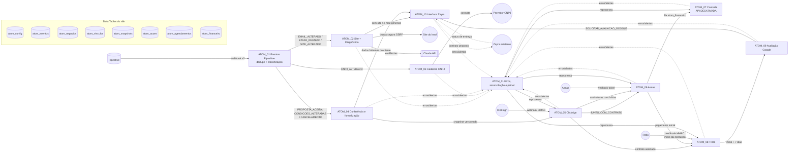

# Arquitetura e diagrama

Instância: `https://thiagoatom.app.n8n.cloud` (projeto `FZmsxQxLoksix7rb`). Todos os workflows foram criados **desativados**.
A Zayra existente e a integração Zayra ↔ Pipedrive **não foram recriadas nem alteradas**. A Zayra só é acionada por um
contrato proposto (ATOM_10), que ainda precisa ser ligado ao mecanismo real.

## Diagrama

## Responsabilidades

| Workflow | ID | Gatilhos | Responsabilidade |
|---|---|---|---|
| ATOM_00_Aplicar_Config | `E3SVfrlTjba5wq8r` | Execução manual / sub-workflow | Utilitário: grava parâmetros em `atom_config` por upsert de `chave`, preservando descrição; recusa valores que pareçam segredos. |
| ATOM_01_Eventos_Pipedrive | `TvKVsmL0ZWMuEb2S` | Webhook `POST /atom/pipedrive` (Basic Auth) | Valida payload v2, deduplica por `meta.id`, ignora alterações feitas só pelo n8n (anti-loop), classifica em gatilhos específicos e despacha. Não cria nem altera registros no Pipedrive. |
| ATOM_02_Site_Diagnostico | `87n6QYXZBijXZPTl` | Sub-workflow (e modo `BUSCA_SEGURA` recursivo) | Escolhe o site (CRM > domínio corporativo do e-mail), busca com proteção SSRF (DNS A/AAAA, IP privado, redirecionamento revalidado a cada salto, máx. 5), classifica, pede o site à Zayra quando necessário, coleta evidências e chama a Claude com saída estruturada. |
| ATOM_03_Cadastro_CNPJ | `KDVf93dE4xuyPLg4` | Sub-workflow | Valida CNPJ (numérico e alfanumérico), consulta provedor configurável, completa **somente campos vazios**; divergências viram pendência (nota), nunca sobrescrita. |
| ATOM_04_Conferencia_Formalizacao | `lvvOD7G5O8ym33m8` | Sub-workflow | Confere dados obrigatórios de campos aprovados, registra pendências sem pedidos repetidos, versiona snapshot (hash), bloqueia alteração pós-envio, trata cancelamento. |
| ATOM_05_Clicksign | `t88mptq0VysxNiKd` | Sub-workflow + Webhook `POST /atom/clicksign` (HMAC) | Envelope → documento por modelo → signatários → requisitos → ativação, com etapas retomáveis (IDs gravados a cada passo). Estados de assinatura. |
| ATOM_06_Asaas | `BlrMhSwF0m6y2s9z` | Sub-workflow + Webhook `POST /atom/asaas` (token no cabeçalho) | Cliente (busca por CNPJ antes de criar), cobranças avulsa/parcelada/recorrente com `externalReference` determinístico, processamento de pagamentos (reconsulta o estado atual), fila financeira. `COBRANCA_DISPARO` nunca é escolhido em silêncio. |
| ATOM_07_Controlle | `eyLqBdUcfmq9hzeS` | A cada 30 min + sub-workflow | Fila persistente → Controlle. **Chamada real desativada** até a API ser fornecida; nada é marcado como sincronizado sem 2xx real. |
| ATOM_08_Trello | `86LFoss4Pzbj4cQy` | Sub-workflow + Webhook `POST/HEAD /atom/trello` (HMAC) | Avalia a liberação (contrato assinado + pagamento inicial + não cancelado), cria cartão/checklist uma vez (lock + vínculo), briefing (opcionalmente pela Claude, só com dados aprovados), registra início efetivo e agenda a avaliação. |
| ATOM_09_Avaliacao_Google | `mz3IlkB8UjriSQzO` | Sub-workflow + a cada 15 min | Agenda 7 dias corridos após o início (janela comercial, America/Sao_Paulo), 1 pedido por empresa por campanha, checagens antes do envio, envio só pela Zayra. Sem seleção por satisfação, sem exigir avaliação positiva, sem recompensa, sem lembretes, sem envio simulado. |
| ATOM_10_Zayra_Interface | `D0MWED51LMZE4FU7` | Sub-workflow + Webhook `POST /atom/zayra/status` (token) | Monta e valida o pedido (`schemas/zayra_acao.schema.json`), idempotente por `request_id`, bloqueia se o mecanismo não estiver configurado. |
| ATOM_11_Erros_Reconciliacao | `vd4MLxMjp8SlGgRh` | Error Trigger, sub-workflow "Alerta interno", a cada hora, Webhook `GET /atom/painel` (token) | Alertas deduplicados e sem segredos, liberação de locks expirados, reprocessamento com backoff, painel de acompanhamento. |

## Princípios aplicados

- **Valores e condições só de campos aprovados** do Pipedrive (mapeados em `atom_config`). A IA nunca define valores, vencimentos, destinatários ou condições.
- **Portão único** (`lib/config.js#portao`): ações com efeito em terceiros exigem configuração `CONFIGURADO` (não `PENDENTE`/`PROPOSTO`) e `MODO_EXECUCAO` ≠ `SIMULACAO`.
- **Idempotência**: `event_key` (eventos), `request_id` (ações), `externalReference` (Asaas), vínculos por ID externo, `chave_campanha` (avaliação).
- **Conteúdo externo não confiável**: sites e mensagens entram na Claude dentro de `<dados_nao_confiaveis>`; saída validada por esquema e pós-validação (URLs citadas precisam ter sido coletadas; promessas proibidas são rejeitadas).
- **Logs sem segredos**: `errorSummary` mascara tokens em URL, cabeçalhos `Authorization`/`x-api-key` e esquemas Bearer/Basic.

## Código-fonte e build

- `lib/` — lógica determinística (testada com `npm test`).
- `n8n/code/wfNN.js` — código dos nós Code, por região (`//#region nome @include libs`).
- `n8n/src/` — definição dos workflows (SDK do n8n).
- `n8n/build.js` — empacota cada região com as libs (esbuild) e gera `n8n/build/*.sdk.ts` e `n8n/dist/*.json` (**JSONs importáveis**).
- Não edite o código dentro do n8n: edite a fonte, rode `npm run build` e atualize o nó.
